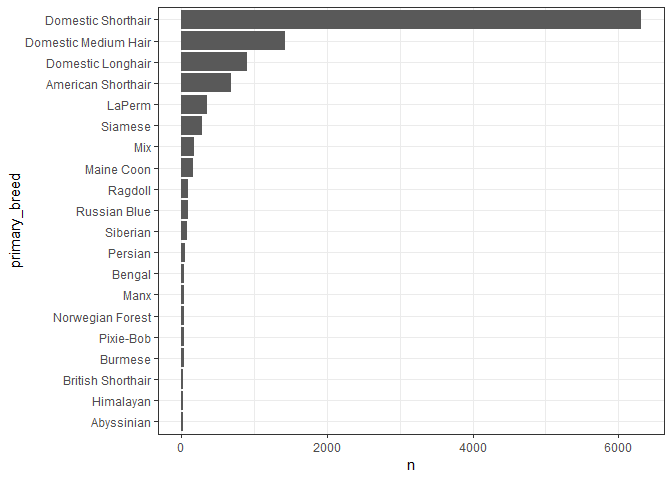
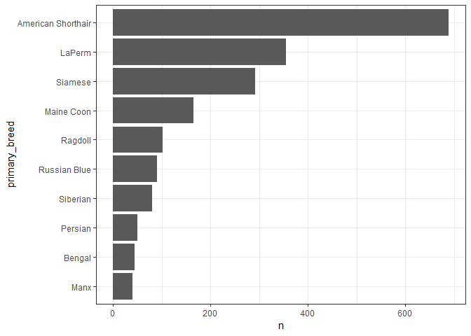

Loading packages


```r
library(tidyverse)
library(knitr)
library(kableExtra)
```


Importing data and doing some basic data cleaning


```r
seattle_pets <- readr::read_csv("https://raw.githubusercontent.com/rfordatascience/tidytuesday/master/data/2019/2019-03-26/seattle_pets.csv") %>% 
  mutate(license_issue_date = lubridate::mdy(license_issue_date), #parsing to proper date format
         pet_id = paste0("ID",row_number())) #creating unique ID for every pet
```


Creating a seperate dataset for all the breed names that are chosen


```r
breeds <- seattle_pets %>% 
  select(pet_id, species, primary_breed, secondary_breed) %>%
  gather(key = breed_type, value = breed_name, -pet_id, -species) %>%  
  separate_rows(breed_name, sep = ",") %>% 
  mutate(breed_name = str_squish(breed_name)) %>%  #removing empty spaces in breed names
  filter(!is.na(breed_name)) #filter out with no breed values
```


```r
#calculates number of breed names for each licence number. for filterting pure and mixed breed animals.   
number_breeds <-  breeds %>%
count(pet_id, sort = TRUE) 
  
#creating a dataset with only pure breed animals
pure_breed_pets <- number_breeds %>% 
  filter(n == 1) %>% 
  left_join(seattle_pets, by = "pet_id") %>% #joining with the main dataset 
  select(-n)

#cats of pure breed
pure_cats <- pure_breed_pets %>% 
  filter(species == "Cat")
  
#the most common cat breeds
pure_cats %>%
  count(primary_breed, sort = TRUE) %>%
  mutate(primary_breed = fct_reorder(primary_breed, n)) %>%
  top_n(primary_breed, n = 20) %>% 
  ggplot(aes(x = primary_breed, y = n)) +
  geom_col() +
  coord_flip() +
  theme_bw()
```

<!-- -->

```r
#filtering out not pure breeds
filter_out_cats <- c("Domestic Shorthair", "Domestic Medium Hair", "Mix", "Domestic Longhair") 
`%not_in%` <- purrr::negate(`%in%`) #creating a "not in" operator


#total number of cats in the entire dataset
total_cats <- as.integer( 
  seattle_pets %>%
  filter(species == "Cat") %>% 
  count() )

#total number of pedigree cats
total_pedigree_cats <- as.integer(
  pure_cats %>%
  count(primary_breed, sort = TRUE) %>%
  filter(primary_breed %not_in% filter_out_cats) %>% 
  summarise(sum(n)))
  

top10_cats <- 
pure_cats %>%
  count(primary_breed, sort = TRUE) %>%
  filter(primary_breed %not_in% filter_out_cats) %>% #using "not in" operator
  mutate(primary_breed = fct_reorder(primary_breed, n)) %>%
  top_n(primary_breed, n = 10) %>% 
  mutate(from_pedigree = scales::percent(n/total_pedigree_cats, accuracy = 0.1),
        from_all_cats = scales::percent(n/total_cats, accuracy = 0.1))
```


```r
top10_cats %>% 
  ggplot(aes(x = primary_breed, y = n)) +
  geom_col() +
  coord_flip() +
  theme_bw()
```

<!-- -->


```r
cat_table <-
top10_cats %>% 
  rename(Breed = primary_breed,
         Cats = n,
         'From Pedigree Cats' = from_pedigree,
         'From All Cats' = from_all_cats)


cat_table %>% 
  kableExtra::kable(caption = "The 10 most common pedigree cats in Seattle") %>% 
  kable_styling(bootstrap_options = c("hover","condensed"), full_width = FALSE, position = "left") %>%
  column_spec(column = 1, width = "10em") %>% 
  column_spec(column = 2, width = "6em") %>% 
  column_spec(column = 3, width = "6em") %>%
  column_spec(column = 4, width = "6em") %>%
  row_spec(0, color = "black") %>% 
  row_spec(6, color = "blue")
```

<table class="table table-hover table-condensed" style="width: auto !important; ">
<caption>The 10 most common pedigree cats in Seattle</caption>
 <thead>
  <tr>
   <th style="text-align:left;color: black !important;"> Breed </th>
   <th style="text-align:right;color: black !important;"> Cats </th>
   <th style="text-align:left;color: black !important;"> From Pedigree Cats </th>
   <th style="text-align:left;color: black !important;"> From All Cats </th>
  </tr>
 </thead>
<tbody>
  <tr>
   <td style="text-align:left;width: 10em; "> American Shorthair </td>
   <td style="text-align:right;width: 6em; "> 689 </td>
   <td style="text-align:left;width: 6em; "> 29.4% </td>
   <td style="text-align:left;width: 6em; "> 4.0% </td>
  </tr>
  <tr>
   <td style="text-align:left;width: 10em; "> LaPerm </td>
   <td style="text-align:right;width: 6em; "> 355 </td>
   <td style="text-align:left;width: 6em; "> 15.1% </td>
   <td style="text-align:left;width: 6em; "> 2.1% </td>
  </tr>
  <tr>
   <td style="text-align:left;width: 10em; "> Siamese </td>
   <td style="text-align:right;width: 6em; "> 292 </td>
   <td style="text-align:left;width: 6em; "> 12.4% </td>
   <td style="text-align:left;width: 6em; "> 1.7% </td>
  </tr>
  <tr>
   <td style="text-align:left;width: 10em; "> Maine Coon </td>
   <td style="text-align:right;width: 6em; "> 165 </td>
   <td style="text-align:left;width: 6em; "> 7.0% </td>
   <td style="text-align:left;width: 6em; "> 1.0% </td>
  </tr>
  <tr>
   <td style="text-align:left;width: 10em; "> Ragdoll </td>
   <td style="text-align:right;width: 6em; "> 102 </td>
   <td style="text-align:left;width: 6em; "> 4.3% </td>
   <td style="text-align:left;width: 6em; "> 0.6% </td>
  </tr>
  <tr>
   <td style="text-align:left;width: 10em; color: blue !important;"> Russian Blue </td>
   <td style="text-align:right;width: 6em; color: blue !important;"> 91 </td>
   <td style="text-align:left;width: 6em; color: blue !important;"> 3.9% </td>
   <td style="text-align:left;width: 6em; color: blue !important;"> 0.5% </td>
  </tr>
  <tr>
   <td style="text-align:left;width: 10em; "> Siberian </td>
   <td style="text-align:right;width: 6em; "> 80 </td>
   <td style="text-align:left;width: 6em; "> 3.4% </td>
   <td style="text-align:left;width: 6em; "> 0.5% </td>
  </tr>
  <tr>
   <td style="text-align:left;width: 10em; "> Persian </td>
   <td style="text-align:right;width: 6em; "> 50 </td>
   <td style="text-align:left;width: 6em; "> 2.1% </td>
   <td style="text-align:left;width: 6em; "> 0.3% </td>
  </tr>
  <tr>
   <td style="text-align:left;width: 10em; "> Bengal </td>
   <td style="text-align:right;width: 6em; "> 45 </td>
   <td style="text-align:left;width: 6em; "> 1.9% </td>
   <td style="text-align:left;width: 6em; "> 0.3% </td>
  </tr>
  <tr>
   <td style="text-align:left;width: 10em; "> Manx </td>
   <td style="text-align:right;width: 6em; "> 40 </td>
   <td style="text-align:left;width: 6em; "> 1.7% </td>
   <td style="text-align:left;width: 6em; "> 0.2% </td>
  </tr>
</tbody>
</table>


```r
seattle_pets %>% 
  filter(animals_name %in% c("Alexa"))
```

```
## # A tibble: 4 x 8
##   license_issue_d~ license_number animals_name species primary_breed
##   <date>           <chr>          <chr>        <chr>   <chr>        
## 1 2018-05-20       S143461        Alexa        Cat     Domestic Sho~
## 2 2017-06-20       354514         Alexa        Dog     Retriever, L~
## 3 2017-03-12       140217         Alexa        Cat     Domestic Lon~
## 4 2017-06-13       211717         Alexa        Dog     Doberman Pin~
## # ... with 3 more variables: secondary_breed <chr>, zip_code <chr>,
## #   pet_id <chr>
```

